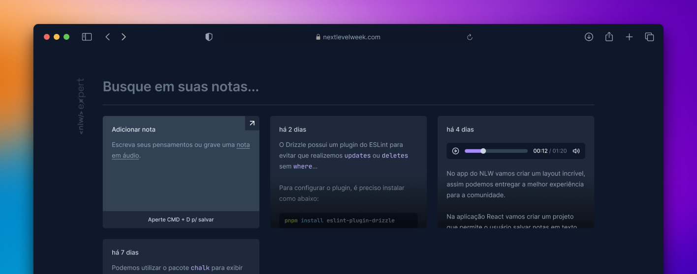

# NLW Expert (React)

This application was developed during Rocketseat’s NLW Experts using React, typescript, Tailwind and the SpeechRecognition API.

## Running

After cloning the repository, access the project folder and execute the commands below:

```sh
yarn install
yarn dev
```

Go to <http://localhost:5173> to view the application.
